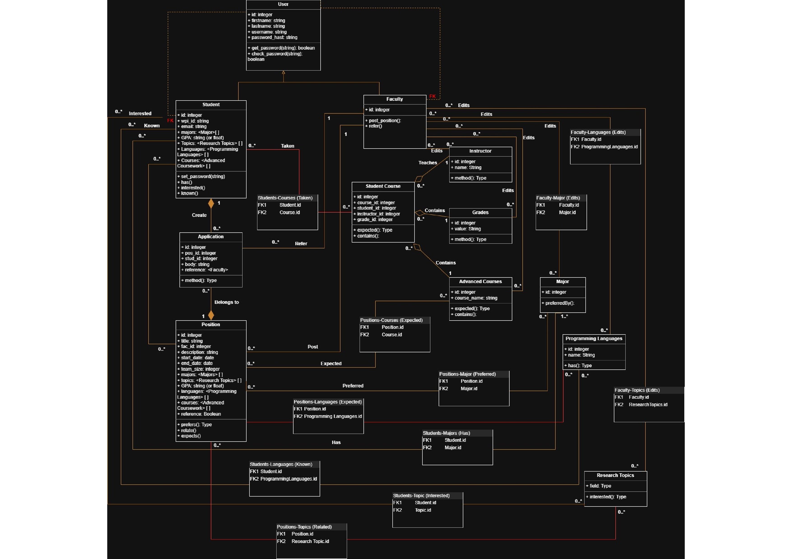
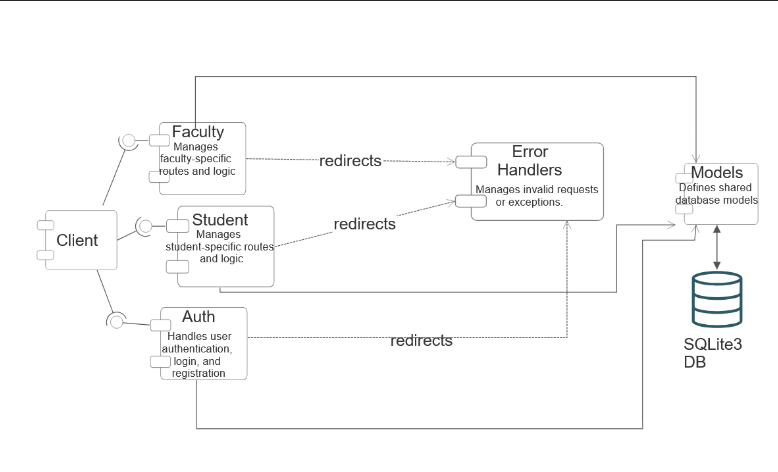
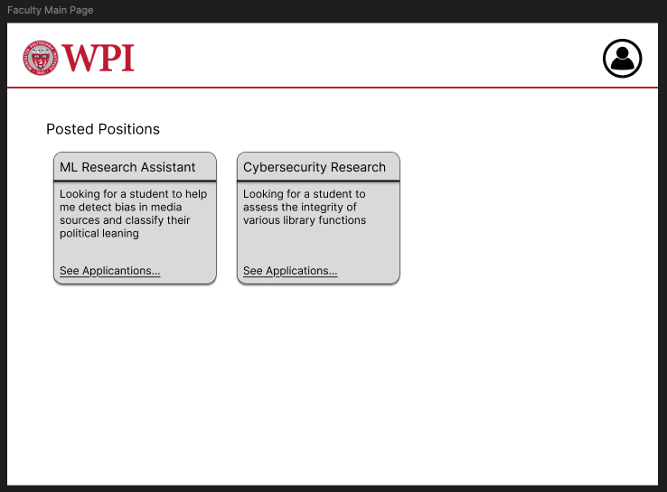
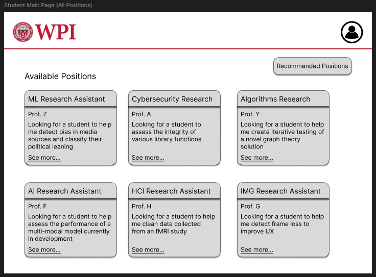
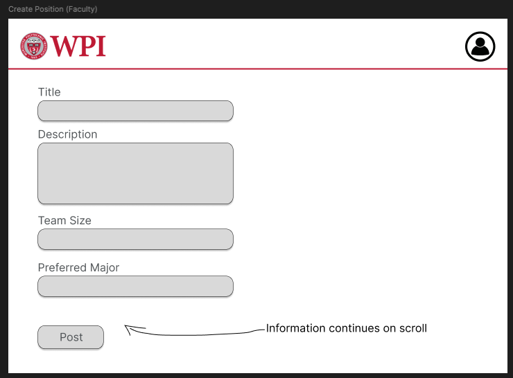
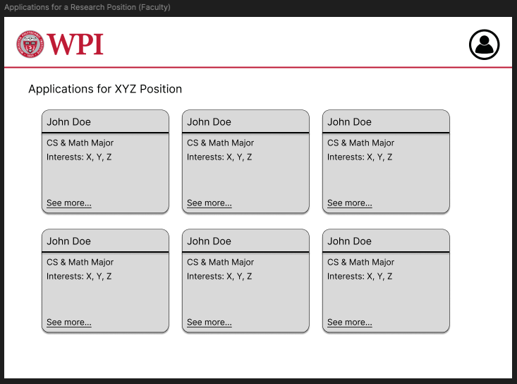
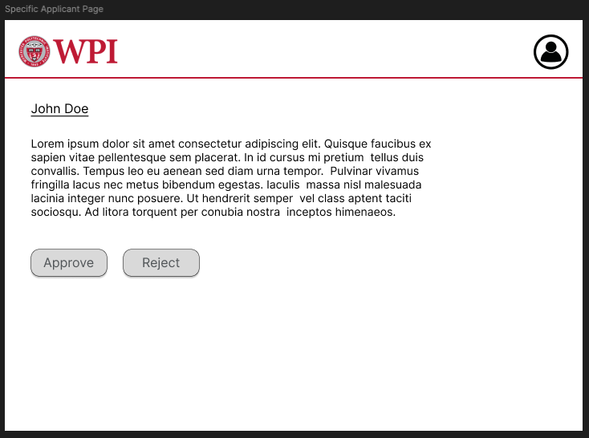
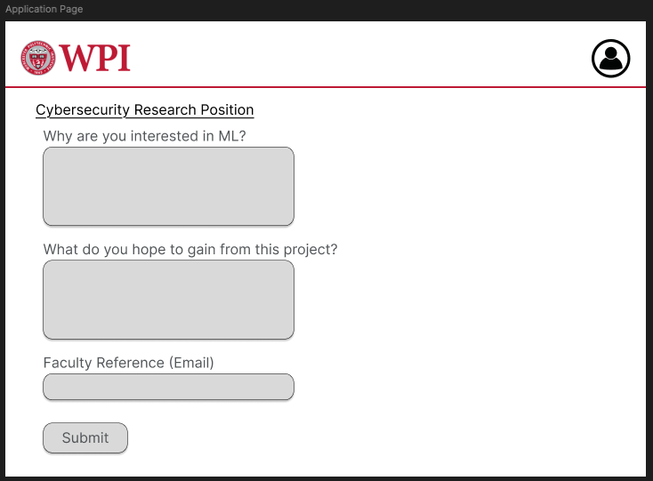

# Project Design Document
## Your Project Title
--------
Prepared by:
* `Sandra Akram, Worcester Polytechnic Institute`
* `Griffin Munhall, Worcester Polytechnic Institute`
* `Tiffany Semexant, Worcester Polytechnic Institute`
* `Devin Orareo, Worcester Polytechnic Institute`
---
**Course** : CS 3733 - Software Engineering
**Instructor**: Sakire Arslan Ay
---
## Table of Contents
- [1. Introduction](#1-introduction)
- [2. Software Design](#2-software-design)
- [2.1 Database Model](#21-model)
- [2.2 Modules and Interfaces](#22-modules-and-interfaces)
- [2.2.1 Overview](#221-overview)
- [2.2.2 Interfaces](#222-interfaces)
- [2.3 User Interface Design](#23-view-and-user-interface-design)
- [3. References](#3-references)
- [Appendix: Grading Rubric](#appendix-grading-rubric)

### Document Revision History
| Name | Date | Changes | Version |
| ------ | ------ | --------- | --------- |
|Revision 1 |2025-11-14 |Initial draft | 1.0 |
|Revision 2 |25-12-1    |Final draft   | 2.0 |

# 1. Introduction
TThis document outlines the high-level design of the application’s backend architecture and user interface. Its purpose is to clearly define the system’s data model, software modules, and external interfaces prior to implementation. Section 2.1 provides a detailed description of the database schema, including all SQLAlchemy models, their roles, and an accompanying UML diagram that illustrates the relationships among tables. Section 2.2 describes the major software modules and blueprints, explains how they interact within the system architecture, and specifies the routes and interfaces that each module exposes. Finally, Section 2.3 presents initial user interface designs for the primary user workflows, including student and faculty interactions with positions, applications, and profile management. Together, these components establish a cohesive blueprint for the application’s functionality and guide the development of a consistent, scalable system.
# 2. Software Design

## 2.1 Database Model
Provide a list of your tables (i.e., SQL Alchemy classes) in your
database model and briefly explain the role of each table.
Provide a UML diagram of your database model showing the
associations and relationships among tables.

| Model | Role |
|-------|------|
| User | Defines shared database model for both student and faculty |
| Student  | represents student user |
| Faculty | represents faculty user|
| Application | Tracks application status and decision | 
| Position | Contains requirements for research positions |
| AdvancedCourses | Upper level courses needed for some positions and can be displayed on student profiles |
| Programming Languages | programming languages needed for student/faculty profiles and psoitions
| ResearchTopics | research topics for student interest and position topics |
| Major | academic major for stuident major, facult domain and psition requirements
| Grades | grades needed for position criteria 
| Courses | Courses taken by students and potential position criteria

Database UML diagram :
<kbd>
      
</kbd>

## 2.2 Modules and Interfaces
### 2.2.1 Overview
Describe the high-level architecture of your software: i.e., the
major modules/blueprints and how they fit together. Provide a UML
component diagram that illustrates the architecture of your
software. Briefly mention the role of each module in your
architectural design. Please refer to the "System Level Design"
lectures in Week 4.

| Model | Role |
|-------|------|
| Models | Defines Shared database models|
| Student  | Manages student specific routes and logic |
| Faculty | Manages faculty specific routes and logic|
| Auth | Handles user authentication, login, and registration |
| Error Handlers | Manages invalid requests or exceptions |

System UML Diagram:
<kbd>
      
</kbd>

### 2.2.2 Interfaces
Include a detailed description of the routes your application
will implement.
* Brainstorm with your team members and identify all routes you
need to implement for the **completed** application.
* For each route specify its , , and .
* You can use the following table template to list your route
specifications.
* Organize this section according to your module decomposition,
i.e., include a sub-section for each module/blueprint and list
all routes for that sub-section in a table.
#### 2.2.2.1 \<Auth> Routes
| | Methods | URL Path | Description |
|:--|:------------------|:-----------|:-------------|
|1.|GET,POST|/register-student|resgisters a new student user|
|2.|GET,POST|/register-faculty/<faculty_id>|activates a premade faculty account |
|3.|GET,POST|/confirm-email/<faculty_id>|sends confirmation email for faculty users|
|4.|/verify/<token>|verifies user after confirming email
|5.|GET|/user/select-faculty|allows user to choose from a predefined list of faculty
|3.|GET,POST|/user/login|logs a user in (student or faculty)|
|4.|GET,POST|/user/logout |logs a user out of the system(student and faculty)|

#### 2.2.2.2 \<Main/student> Routes
| | Methods | URL Path | Description |
|:--|:------------------|:-----------|:-------------|
|1. |GET |/student/index |homepage for student user |
|2. |GET |/position/view/<int:position_id> |view the details of a position |
|3. |POST |/apply/<int:position_id> | apply for a position |
|4. |GET |/<position_id>/<application_id>/view |view an application status |
|5. |GET |/student/profile |view your student profile |
|6. |GET,POST |/edit_profile |edit your student profile |

#### 2.2.2.3 \<Main/faculty> Routes
| | Methods | URL Path | Description |
|:--|:------------------|:-----------|:-------------|
|1. |GET |/faculty/index |faculty user home page |
|2. |GET,POST |/create_position |create a new position |
|3. |GET |/faculty/profile |view profile |
|4. |GET |/position/<int:position_id>/applicants |view all aplications for a position |
|5. |POST |/application/<int:app_id>/update |updates the status of a specific application to either approved or rejected |
|6. |POST | /faculty/recommendation/<recommendation_id>/approve |approve a reccomendation for an application |
|7. |POST |/faculty/recommendation/<recommendation_id>/deny|deny a recommendation for an application |
|8. |GET,POST |/position/<int:position_id>/edit |edit a posted position |
|9.|GET,POST |/position/<int:applicant_id>/ | view a speciffic application for a position |
|10. |/faculty/majors|shows a list of predefined majors |
|11. |GET,POST |/faculty/majors/create |create a new major in the lsit |
|12.|GET,POST |/faculty/majors/<int:major_id>/edit | edit a major in the list |
|13.|POST |/faculty/majors/<int:major_id>/delete | delets a major from the list |
|14. |/faculty/topics|shows a list of predefined research topics |
|15. |GET,POST |/faculty/topics/create |create a new topic in the lsit |
|16.|GET,POST |/faculty/topics/<int:topic_id>/edit | edit a topic in the list |
|17.|POST |/faculty/topics/<int:topic_id>/delete | delets a topic from the list |
|18. |/faculty/courses|shows a list of predefined courses |
|19. |GET,POST |/faculty/courses/create |create a new course in the lsit |
|20.|GET,POST |/faculty/courses/<int:course_id>/edit | edit a course in the list |
|21.|POST |/faculty/majors/<int:course_id>/delete | delets a course from the list |
|22. |/faculty/languages|shows a list of predefined programming languages |
|23. |GET,POST |/faculty/languages/create |create a new language in the lsit |
|24.|GET,POST |/faculty/languages/<int:language_id>/edit | edit a language in the list |
|25.|POST |/faculty/languages/<int:language_id>/delete | delets a language from the list |

Repeat the above for other modules you included in your
application.

### 2.3 User Interface Design
Provide UI sketches or screenshots for the following pages:
* Faculty main page
* Student main page (show how you will display "all positions" vs
"recommended positions")
* Faculty creating a position
* Faculty accepting /rejecting an application
* Student applying a position

<kbd>
      
      
      
      
      
      
</kbd>

# 3. References
Cite your references here.
For the papers you cite give the authors, the title of the
article, the journal name, journal volume number, date of
publication and inclusive page numbers. Giving only the URL for
the journal is not appropriate.
For the websites, give the title, author (if applicable) and the
website URL.
----
